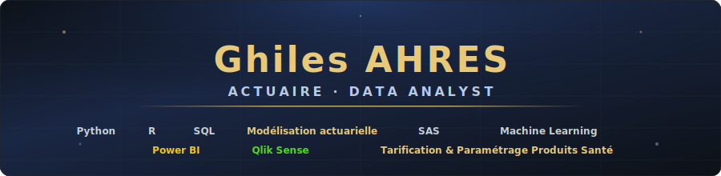

---

<div align="center">

<!-- Banner SVG local -->


<!-- Badges de contact -->
<a href="mailto:ghiles.ahres@gmail.com">
  
</a>

<a href="https://www.linkedin.com/in/ghiles-ahres">
  
</a>

<br/><br/>

---

## 👤 À propos

> Actuaire et data analyst spécialisé dans la **modélisation des risques**, l’automatisation des processus actuariels et l’exploitation de données complexes en assurance et protection sociale.  
> Mon approche est orientée **impact métier** : transformer la donnée en décisions fiables, interprétables et actionnables.

- 🎓 Diplômé en Ingénierie Mathématiques & Statistiques Actuarielles — *Aix-Marseille Université (2020)*
- 💼 Chargé d’Études Actuarielles @ **April Santé Prévoyance**
- 📊 Spécialisé en modélisation actuarielle, data analysis et reporting décisionnel
- 📫 Contact : [ghiles.ahres@gmail.com](mailto:ghiles.ahres@gmail.com)

---

## 🛠️ Stack technique

<div align="center">

### Langages & Outils


</div>

---

## 🎯 Domaines d’expertise

<div align="center">

| | Domaine | Compétences clés |
|:---:|:---|:---|
| 📉 | **Actuariat** | Tarification · Provisionnement · Modélisation du risque |
| 📊 | **Data Analysis** | Exploration · Visualisation · Reporting automatisé |
| 🤖 | **Modélisation statistique** | Régression · Segmentation · Analyse prédictive |
| 🏥 | **Protection sociale** | Santé · Prévoyance · Analyse des prestations |

</div>

---

## 📁 Projets

### 🔹 Suivi de l’Absentéisme au Travail

> Pipeline end-to-end de valorisation de la donnée RH, de la collecte DSN à la restitution décisionnelle.

**🎯 Objectif :**  
Construire un outil de pilotage de l’absentéisme permettant d’analyser les coûts, les tendances et les facteurs explicatifs.

**🔄 Pipeline :**

```text
Flux DSN → Structuration → Nettoyage & analyse (R / SAS) → Restitution interactive (SAS Viya)
